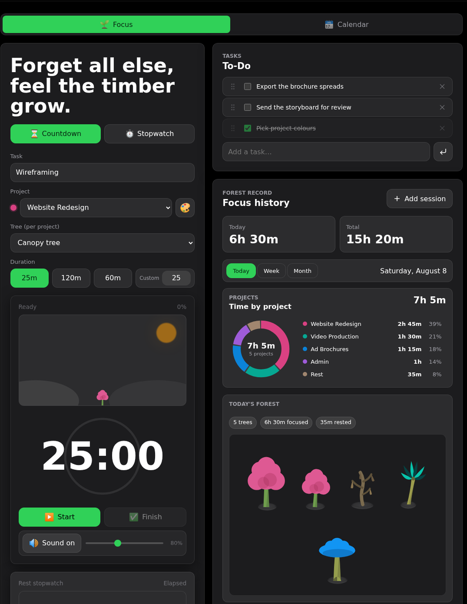
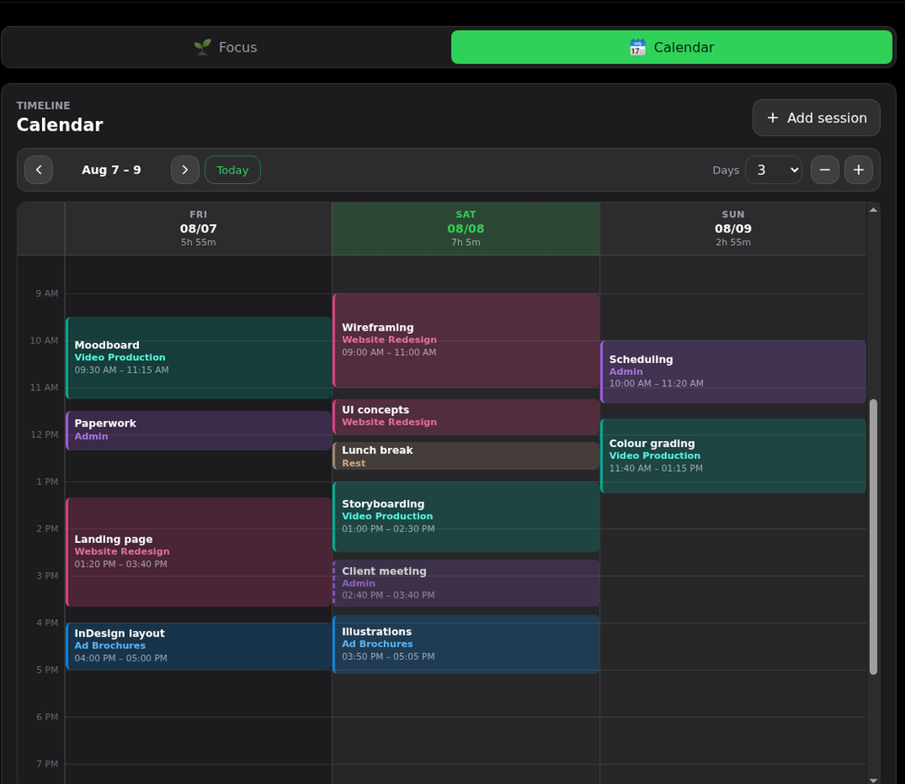
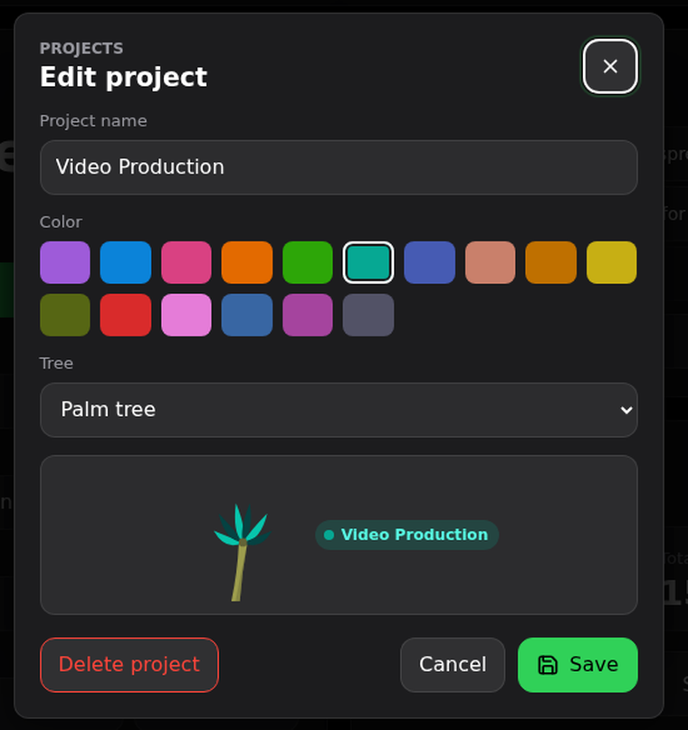

# 🌲 TimberTimer

**Grow a forest while you focus.** A free, minimalist focus timer that plants a tree for every focus session, keeps a to‑do list, and (optionally) syncs across your devices with Google.

Live: **https://hanifedma.com/timbertimer/**

No build step — it's a static site (HTML/CSS/vanilla JS) that also works offline as an installable PWA.

## A look at it

Timer, to‑do list, and where the day actually went — each project in its own colour,
and a forest grown from the sessions you finished.



The calendar shows one to seven days at a time. Drag empty space to add a record,
drag a block to move it, or drag its edges to change when it started or ended.



A project owns its colour and its tree, so recolouring one re‑plants its whole forest.
Name a new project and both are picked for you.



## Features

- **Projects with their own colour and tree** — every record belongs to a project; pick from 16 colours and 7 tree species, or just name it and let both be chosen for you. Change a project's colour and its whole forest changes with it.
- **Calendar view** — a Toggl-style day grid showing 1–7 days at once (3 by default), zoomable, with a live "now" line. Drag empty space to block out a new record, drag a block to move it (across days too), or drag its edges to change when it started or ended. Tap anything to edit it.
- **Tasks remember their project** — track "wash dishes" under Errands once and choosing that task picks Errands again by itself, on any device.
- **Time by project** — a donut chart and breakdown of where the period's hours went, in each project's colour.
- **Countdown & stopwatch** focus modes. You still choose how long a countdown runs, but that goal is not written onto the record it leaves behind: a finished session is just when it ran and for how long, so ending one early costs you nothing but the time you didn't spend.
- **Forest visualizer** — day / week / month views of the trees you've grown, each steppable backwards, so yesterday's forest is one tap away. Every session plants a tree, sized by the time it actually took.
- **Rest is a project too**, so rests can be added by hand like any other record.
- **Rest timer with shortcuts** — 5, 10 or 15 minutes, or any length you type, and a **stubborn alarm** when it lands: a looping tone that is scheduled on the audio clock ahead of time (so a throttled background tab still makes the noise), a notification that stays until it is answered rather than fading, a flashing tab title, and a full-bleed sheet on the page. It rings for two minutes and then falls quiet, but the sheet and the notification stay until you dismiss them. **Silent by default** — the sheet and the notification still arrive, they just do not shout; switch **Rest alarm** to *Sound* to make it audible. It is a separate setting from the timer chime, because muting a cue you work through says nothing about wanting to sleep through the end of a break. Prefer the old behaviour? **Open-ended** runs the rest as a plain stopwatch.
- **To‑do list** with drag‑to‑reorder, synced when signed in.
- **Editable, searchable focus history** with today/total stats.
- **Sound cues** with an adjustable volume, and remaining time shown in the browser tab.
- **Light / dark themes** (dark by default), remembered per device.
- **Works offline**, installable, cross‑device active‑timer + records sync for signed‑in users.
- **Live sync** over Supabase Realtime — a session started on another device shows up here at once, with polling kept as a fallback.

## Run locally

Open `index.html` in a browser, or serve the folder:

```bash
python3 -m http.server 4173
# then visit http://localhost:4173
```

Local storage works with zero setup. Google sync is optional (see below).

## Supabase setup (optional — for cross‑device sync)

GitHub Pages serves static files only, so cross‑device sync uses Supabase for the database and auth.

1. Create a Supabase project.
2. Open **SQL Editor**, paste all of `docs/supabase-schema.sql`, and **Run** it (creates the tables + per‑user row‑level security). The file is safe to re‑run, and doing so is how you upgrade an existing database — the projects table, the `project_id` columns and the rest timer's `end_at` / `duration_minutes` are all added by the same script. Skipping it costs only cross‑device rest countdowns (each client drops the two columns on the first rejection and keeps working); the alarm is scheduled locally, so it still fires on the device that set it.
3. **Project Settings → API**: copy the Project URL and the anon/publishable key.
4. Put them in `src/supabase-config.js`:

```js
window.TIMBERTIMER_SUPABASE = {
  url: "https://your-project.supabase.co",
  anonKey: "your-anon-or-publishable-key",
};
```

The anon/publishable key is safe in a browser app: the SQL policies check `auth.uid() = user_id`, so each signed‑in user can only read and write their own rows.

### Live updates (optional, recommended)

Supabase only streams changes for tables that are published for replication, and none are by default. In the **SQL Editor**, run:

```sql
alter publication supabase_realtime add table public.focus_sessions;
alter publication supabase_realtime add table public.active_focus_timers;
alter publication supabase_realtime add table public.active_rest_timers;
alter publication supabase_realtime add table public.notes;
alter publication supabase_realtime add table public.projects;
```

With this, changes made on another device arrive immediately. Without it everything still syncs — the app falls back to polling every 15 seconds — so this is safe to skip and safe to add later.

## Google login

Google is the only sign‑in method (no email/password form).

1. Supabase → **Authentication → Providers** → enable **Google**; note the callback URL it shows.
2. Google Cloud Console → create an **OAuth web client**:
   - **Authorized JavaScript origins**: your app origin (e.g. `https://hanifedma.com`, and `http://localhost:4173` for local). Origins are scheme + host only — no path, no trailing slash.
   - **Authorized redirect URI**: the Supabase callback URL from step 1.
3. Paste the Google Client ID + Secret into Supabase's Google provider settings.
4. Supabase → **Authentication → URL Configuration**: set **Site URL** to your deployed URL and add `<your-url>/**` (plus `http://localhost:4173/**`) to **Redirect URLs**.

### Showing your own site on Google's prompt (optional)

With the steps above, signing in redirects through Supabase, so Google's prompt
names the Supabase callback (`your-project.supabase.co`) rather than your site.
To have it name your site instead, sign in without leaving the page:

1. Put the **same client id** from step 2 into `src/supabase-config.js`:

   ```js
   googleClientId: "1234567890-abc123.apps.googleusercontent.com",
   ```

2. Supabase → **Authentication → Providers → Google** → add that client id to
   **Authorized Client IDs** (the field below the secret). This is what lets
   Supabase accept the token Google hands back.

The app then renders Google's own button and completes sign‑in in a popup, so
the prompt names your domain. Anything missing — no client id, an unlisted one,
a blocked script, or plain `http://` — and it quietly falls back to the redirect
flow, which keeps working exactly as before.

## Deploy on GitHub Pages

1. Push this folder to a repository's `main` branch.
2. **Settings → Pages** → Source: *Deploy from a branch* → `main` / `/ (root)` → Save.
3. Your app is served at `https://YOUR_USERNAME.github.io/YOUR_REPOSITORY/`.
4. Add that URL to Supabase's allowed Site/Redirect URLs.

> Note: canonical/Open Graph URLs in `index.html`, `robots.txt`, and `sitemap.xml` point at `https://hanifedma.com/timbertimer/`. If you deploy elsewhere (e.g. a custom domain), update those URLs.

## Upgrading an existing install

**Re-run `docs/supabase-schema.sql` before deploying this version.** A record no longer stores a goal or an outcome, so `focus_sessions.duration_minutes` and `focus_sessions.status` are gone — and both were `not null`, so a client that has stopped writing them cannot save a session until the script has run. It is safe to re-run, and it does the migration in the right order: it writes each pre-projects record's project down first (the last thing `status` was needed for), then drops the columns. `active_focus_timers` is untouched — a running countdown still needs to know when it ends.

After that, everything else degrades gracefully:

- Records made before projects existed are grouped into a project named after their session title, keeping the tree they were planted with. The mapping is worked out the same way on every device, so nothing has to be migrated up front.
- If `docs/supabase-schema.sql` hasn't been re‑run yet, projects are kept on the device and records still save — they just don't carry their project to the cloud until the columns exist.

## Project layout

- `index.html` — app shell + SEO/Open Graph metadata.
- `404.html` — themed not‑found page.
- `src/app.js` — timer, records, notes, themes, local storage, Supabase integration.
- `src/styles.css` — responsive light/dark UI.
- `src/supabase-config.js` — Supabase connection settings.
- `docs/supabase-schema.sql` — database tables + per‑user RLS policies.
- `docs/screenshots/` — the images in this README.
- `service-worker.js` — offline PWA cache.
- `manifest.webmanifest` — install metadata.
- `robots.txt`, `sitemap.xml` — SEO.
- `assets/` — app icons and the Open Graph share image.
